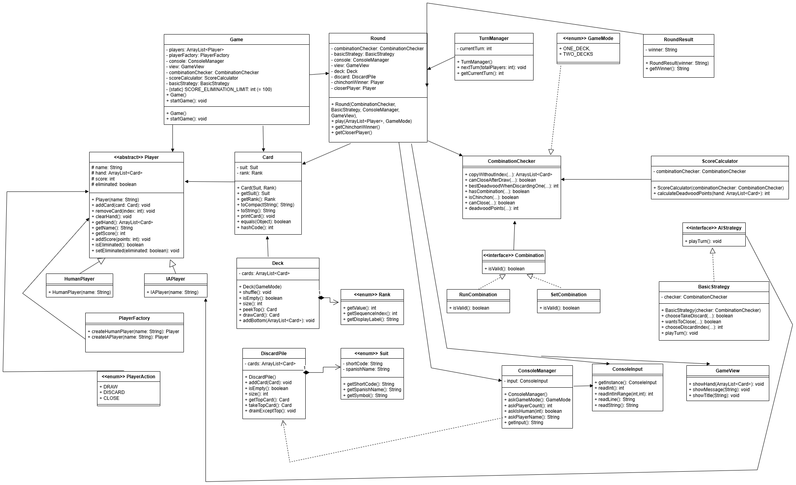

# Juego de Chinchón en Java
Proyecto desarrollado en **Java** que implementa el juego de cartas **Chinchón**, permitiendo partidas por consola entre **jugadores humanos** y **jugadores controlados por inteligencia artificial (IA)**.

El proyecto ha sido desarrollado aplicando conceptos de **Programación** y contenidos trabajados en el módulo de **Entornos de Desarrollo**, incluyendo arquitectura del software, patrones de diseño, pruebas unitarias, UML y documentación técnica.

## Objetivo del proyecto
El objetivo principal del proyecto es recrear digitalmente el juego tradicional **Chinchón**, respetando sus reglas principales y permitiendo la gestión automática de:

* configuración de jugadores
* desarrollo de rondas
* control de turnos
* detección de combinaciones
* cálculo de puntuaciones
* victoria y eliminación de jugadores


## Características principales
El sistema implementa las siguientes funcionalidades:

* Partidas configurables entre **2 y 5 jugadores**
* Soporte para **jugadores humanos**
* Soporte para **jugadores IA**
* Gestión automática de rondas
* Sistema completo de turnos
* Mazo y descarte dinámicos
* Detección automática de combinaciones válidas
* Sistema de puntuación
* Cierre de ronda
* Victoria automática por **Chinchón**
* Eliminación por límite de puntos
* Juego completo ejecutado por consola

## Funcionamiento general del juego
La partida se divide en múltiples rondas.

Durante cada ronda se desarrolla el siguiente flujo:

**1. Configuración inicial**

Al comenzar la partida el usuario configura:
* número total de jugadores
* jugadores humanos
* jugadores IA

Tras la configuración se inicializa la partida.

**2. Reparto de cartas**

Cada jugador recibe **7 cartas**.

La primera carta del descarte queda visible.

**3. Turno del jugador**

En su turno, cada jugador debe:
1. Robar una carta.
2. Elegir entre:
	* robar del mazo o robar del descarte.
3. Revisar su mano.
4. Decidir qué carta descartar.

Al finalizar el turno siempre debe mantener **7 cartas en mano**.

**4. Combinaciones**

Durante la partida se pueden formar:

*- Iguales*

Tres o más cartas del mismo valor.

Ejemplo: 3 Oros — 3 Copas — 3 Espadas

*- Escalera*

Tres o más cartas consecutivas del mismo palo.

Ejemplo: 5 Copas — 6 Copas — 7 Copas

*- Chinchón*

Siete cartas consecutivas del mismo palo.
Esta combinación provoca **victoria automática**.

**5. Cierre de ronda**

Un jugador puede cerrar la ronda cuando cumple las condiciones permitidas por las reglas del juego.

**6. Finalización de la partida**

La partida finaliza cuando:
* un jugador realiza **Chinchón**
* o únicamente queda **un jugador activo**


## Estructura del proyecto
El proyecto se organiza siguiendo una separación clara de responsabilidades.

```
src/
│
├── main/
│   └── Main.java
│
├── modelGame/
│
├── modelCards/
│
├── modelPlayers/
│
├── modelCombinations/
│
├── modelScore/
│
├── iA/
│
└── userInterface/

test/
│
├── pruebas unitarias

docs/
│
├── documentación técnica
├── UML
└── JavaDoc

assets/
│
└── capturas e imágenes
```

**Descripción general de carpetas**

* src/

Contiene el código fuente principal del proyecto.

* test/

Incluye las pruebas unitarias desarrolladas mediante JUnit 5.

* docs/

Contiene la documentación técnica del proyecto.

* assets/

Almacena capturas, diagramas UML y recursos gráficos utilizados en la documentación.

## UML
El proyecto incorpora un **diagrama UML**, utilizado para representar:
* estructura del sistema
* clases principales
* relaciones entre componentes
* herencia
* asociaciones
* dependencias

El UML permite comprender rápidamente la arquitectura general del juego.



## Documentación del proyecto
Para facilitar la comprensión del sistema, el proyecto dispone de documentación organizada en varios archivos.

**Reglas del juego**

Explicación completa del funcionamiento, combinaciones, puntuación y reglas de partida.

[Reglas.md](Reglas.md)

**Documentación técnica**

Incluye:
* arquitectura del sistema
* estructura de carpetas
* descripción de clases
* patrones de diseño
* organización del proyecto
* pruebas unitarias
* UML
* JavaDoc

[Documentacion.md](Documentacion.md)

**Pruebas unitarias**

Como parte del proceso de validación del software, el proyecto incluye un conjunto de pruebas unitarias realizadas con JUnit 5. Estas pruebas permiten verificar la fiabilidad de la lógica implementada y detectar posibles errores en funcionalidades críticas del juego.

Para su utilización es necesario añadir la dependencia correspondiente de JUnit 5 al entorno de desarrollo.

Descripción del enfoque de testing utilizado:
* caja negra
* caja blanca
* organización de pruebas
* evidencias de ejecución

[Ver Test](Test.md)

## JavaDoc
Se ha generado documentación **JavaDoc** para las principales clases y métodos del proyecto.

La documentación incluye:
* responsabilidades de clases
* parámetros
* valores devueltos
* descripción funcional de métodos

JavaDoc facilita el mantenimiento del sistema y la comprensión del código.

Acceso: [Ver JavaDoc](doc/index.html)

## Autor
Proyecto desarrollado para el módulo de Programación / Entornos de Desarrollo.

Autor: Andrea Ruiz Moreno
