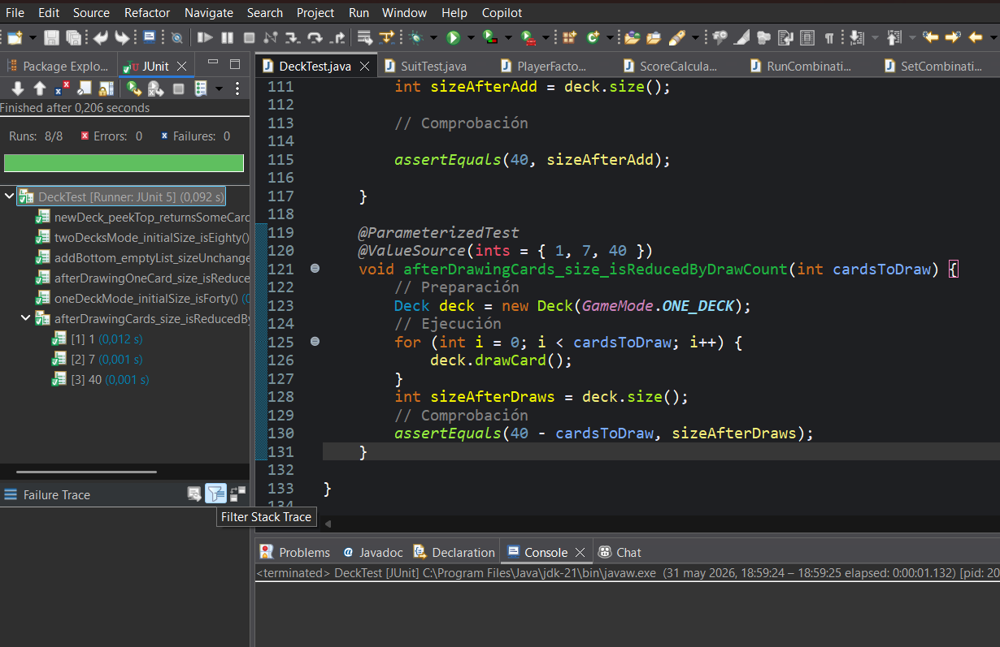
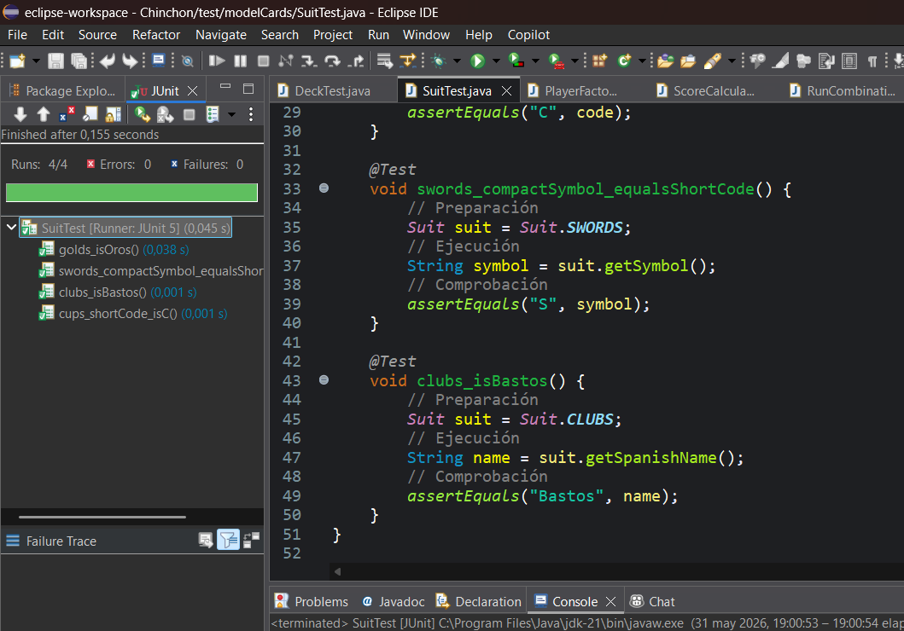
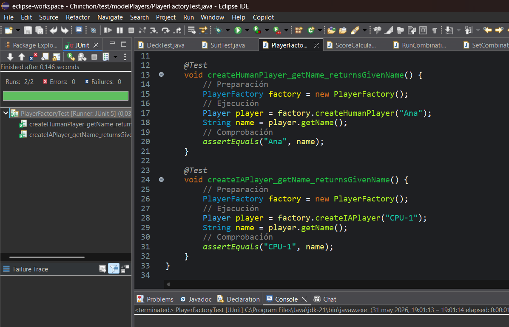
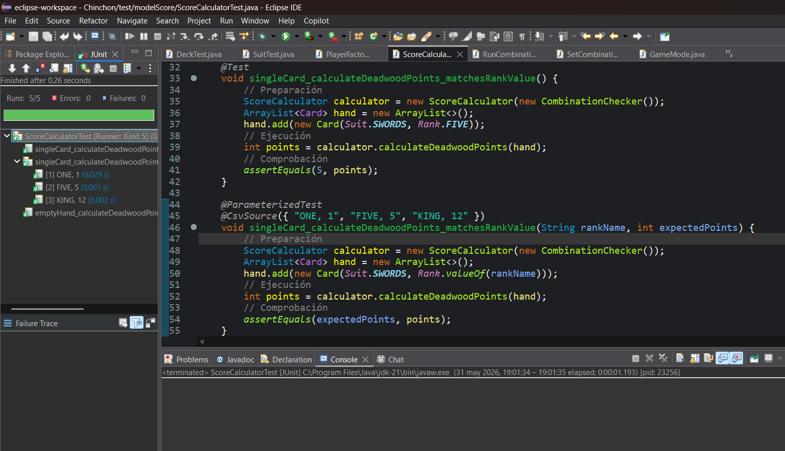

# Test.md — Pruebas unitarias del proyecto

# Introducción
El proyecto incluye un conjunto de pruebas unitarias desarrolladas con **JUnit 5**, cuyo objetivo es garantizar el correcto funcionamiento de las principales clases del sistema.

Las pruebas se han diseñado siguiendo dos enfoques:

- **Caja negra**: validación de resultados sin conocer la implementación interna.
- **Caja blanca**: validación de rutas internas y comportamiento lógico del código.

---

# Herramientas utilizadas
- Java
- JUnit 5

Se han utilizado:
- `@Test`
- `@ParameterizedTest`
- `@ValueSource`
- `@CsvSource`

---

# Organización de los tests

Los tests se encuentran en la carpeta: test/

Separados del código fuente (`src/`) 
 
Organización por paquetes igual que el proyecto principal:
- `modelCards`
- `modelPlayers`
- `modelScore`

Esto facilita el mantenimiento y localización de pruebas.

---

# Cobertura y enfoque de pruebas

Las pruebas existentes validan partes concretas del sistema: construccion y operaciones basicas del mazo (`Deck`), datos publicos de los palos (`Suit`), creacion de jugadores mediante fabrica (`PlayerFactory`) y calculo de puntuacion de mano muerta (`ScoreCalculator` con `CombinationChecker`).

El enfoque de caja negra se aplica mayoritariamente: los tests interactuan con metodos publicos como `size()`, `drawCard()`, `peekTop()`, `getSpanishName()`, `getShortCode()`, `getName()` y `calculateDeadwoodPoints()`, comprobando resultados observables sin acceder a atributos privados.

El enfoque de caja blanca aparece de forma limitada en la seleccion de casos que ejercitan ramas conocidas de la logica, especialmente el caso base de mano vacia en el calculo de mano muerta. Aun asi, no hay tests que llamen directamente a metodos privados ni que dependan de la representacion interna de las colecciones.

Las pruebas parametrizadas se usan en dos puntos adecuados: el robo de varias cantidades de cartas del mazo mediante `ValueSource` y la comprobacion de rangos individuales mediante `CsvSource`. Esto mejora la cobertura de escenarios sin duplicar codigo de test.

En conjunto, las pruebas unitarias aportan confianza sobre reglas basicas del proyecto, detectan regresiones en componentes del modelo y sirven como documentacion ejecutable de comportamientos esenciales para una implementacion academica de Chinchon por consola.

## DeckTest

### Objetivo

Validar el comportamiento basico de `Deck`, responsable de construir el mazo segun el modo de partida, consultar su tamano, robar cartas, consultar la carta superior y anadir cartas al fondo del mazo. La clase se prueba mediante su API publica, comprobando que el estado observable del mazo coincide con las reglas del juego.

### Tests implementados

#### oneDeckMode_initialSize_isForty

- Que comprueba: que un mazo creado con `GameMode.ONE_DECK` contiene 40 cartas.
- Datos de entrada utilizados: una instancia de `Deck` inicializada con `GameMode.ONE_DECK`.
- Resultado esperado: `deck.size()` devuelve `40`.
- Por que esa validacion es importante: confirma que el modo de una baraja construye una baraja espanola completa con 4 palos y 10 rangos.
- Tipo de prueba: Caja negra.

#### twoDecksMode_initialSize_isEighty

- Que comprueba: que un mazo creado con `GameMode.TWO_DECKS` contiene 80 cartas.
- Datos de entrada utilizados: una instancia de `Deck` inicializada con `GameMode.TWO_DECKS`.
- Resultado esperado: `deck.size()` devuelve `80`.
- Por que esa validacion es importante: verifica que el modo de dos barajas duplica correctamente el numero total de cartas disponibles para la partida.
- Tipo de prueba: Caja negra.

#### afterDrawingOneCard_size_isReducedByOne

- Que comprueba: que al robar una carta el tamano del mazo disminuye en una unidad.
- Datos de entrada utilizados: un `Deck` en modo `GameMode.ONE_DECK` y una llamada a `drawCard()`.
- Resultado esperado: tras robar una carta, `deck.size()` devuelve `39`.
- Por que esa validacion es importante: garantiza que `drawCard()` no solo devuelve una carta, sino que tambien la elimina del mazo.
- Tipo de prueba: Caja negra.

#### newDeck_peekTop_returnsSomeCard

- Que comprueba: que un mazo recien creado permite consultar una carta superior.
- Datos de entrada utilizados: un `Deck` en modo `GameMode.ONE_DECK`.
- Resultado esperado: `peekTop()` devuelve una referencia distinta de `null`.
- Por que esa validacion es importante: confirma que el mazo inicial no esta vacio y que la consulta de la carta superior funciona sin modificar el estado.
- Tipo de prueba: Caja negra.

#### addBottom_emptyList_sizeUnchanged

- Que comprueba: que anadir una lista vacia al fondo del mazo no altera su tamano.
- Datos de entrada utilizados: un `Deck` en modo `GameMode.ONE_DECK` y un `ArrayList<Card>` vacio.
- Resultado esperado: tras llamar a `addBottom(emptyList)`, `deck.size()` sigue devolviendo `40`.
- Por que esa validacion es importante: valida un caso limite de `addBottom`, usado cuando el juego rellena el mazo con cartas procedentes del descarte.
- Tipo de prueba: Caja negra.

#### afterDrawingCards_size_isReducedByDrawCount

- Que comprueba: que el tamano del mazo disminuye exactamente en funcion del numero de cartas robadas.
- Datos de entrada utilizados: un `Deck` en modo `GameMode.ONE_DECK` y los valores `1`, `7` y `40` como cantidades de robos.
- Resultado esperado: el tamano final del mazo es `40 - cardsToDraw` para cada caso.
- Por que esa validacion es importante: cubre varios escenarios de robo, incluido el caso limite de robar todas las cartas del mazo.
- Tipo de prueba: Caja negra y Parametrizada.
- Estrategia usada: `ValueSource(ints = { 1, 7, 40 })`.
- Que escenarios diferentes cubre: un robo minimo, varios robos equivalentes a una mano completa y el vaciado completo de una baraja.
- Ventajas de usar parametrizacion en ese caso: evita duplicar tres tests casi iguales y permite comprobar la misma regla con distintos volumenes de entrada.

### Ejecución de los test:

[Ver código](test/modelCards/DeckTest.java)

## SuitTest

### Objetivo

Comprobar que el enum `Suit` expone correctamente los nombres en espanol, codigos cortos y simbolos utilizados por la salida de consola y las representaciones compactas de cartas.

### Tests implementados

#### golds_isOros

- Que comprueba: que el palo `Suit.GOLDS` se presenta con el nombre `"Oros"`.
- Datos de entrada utilizados: la constante `Suit.GOLDS`.
- Resultado esperado: `getSpanishName()` devuelve `"Oros"`.
- Por que esa validacion es importante: asegura que el nombre mostrado al usuario coincide con la terminologia de la baraja espanola.
- Tipo de prueba: Caja negra.

#### cups_shortCode_isC

- Que comprueba: que el palo `Suit.CUPS` tiene como codigo corto la letra `"C"`.
- Datos de entrada utilizados: la constante `Suit.CUPS`.
- Resultado esperado: `getShortCode()` devuelve `"C"`.
- Por que esa validacion es importante: valida el codigo que se usa en representaciones compactas y mensajes de consola.
- Tipo de prueba: Caja negra.

#### swords_compactSymbol_equalsShortCode

- Que comprueba: que el simbolo compacto de `Suit.SWORDS` es `"S"`.
- Datos de entrada utilizados: la constante `Suit.SWORDS`.
- Resultado esperado: `getSymbol()` devuelve `"S"`.
- Por que esa validacion es importante: confirma que el simbolo mostrado en cartas compactas es coherente con el codigo corto definido para el palo.
- Tipo de prueba: Caja negra.

#### clubs_isBastos

- Que comprueba: que el palo `Suit.CLUBS` se presenta con el nombre `"Bastos"`.
- Datos de entrada utilizados: la constante `Suit.CLUBS`.
- Resultado esperado: `getSpanishName()` devuelve `"Bastos"`.
- Por que esa validacion es importante: verifica otro nombre visible para el usuario y reduce el riesgo de errores en la salida textual del juego.
- Tipo de prueba: Caja negra.

### Ejecución de los test:

[Ver código](test/modelCards/SuitTest.java)

## PlayerFactoryTest

### Objetivo

Validar que `PlayerFactory` crea jugadores del tipo solicitado conservando el nombre recibido como parametro. La prueba se centra en el contrato publico de la fabrica, no en detalles internos de las subclases.

### Tests implementados

#### createHumanPlayer_getName_returnsGivenName

- Que comprueba: que al crear un jugador humano se mantiene el nombre indicado.
- Datos de entrada utilizados: una instancia de `PlayerFactory` y el nombre `"Ana"`.
- Resultado esperado: `player.getName()` devuelve `"Ana"`.
- Por que esa validacion es importante: garantiza que la configuracion inicial de jugadores humanos conserva los datos introducidos por el usuario.
- Tipo de prueba: Caja negra.

#### createIAPlayer_getName_returnsGivenName

- Que comprueba: que al crear un jugador IA se mantiene el nombre indicado.
- Datos de entrada utilizados: una instancia de `PlayerFactory` y el nombre `"CPU-1"`.
- Resultado esperado: `player.getName()` devuelve `"CPU-1"`.
- Por que esa validacion es importante: asegura que los jugadores controlados por la maquina tambien quedan identificados correctamente en turnos, marcadores y mensajes.
- Tipo de prueba: Caja negra.

### Ejecución de los test:

[Ver código](test/modelPlayers/PlayerFactoryTest.java)

## ScoreCalculatorTest

### Objetivo

Comprobar que `ScoreCalculator` calcula correctamente los puntos de mano muerta delegando en `CombinationChecker`. Las pruebas se centran en manos simples: mano vacia y manos con una unica carta, donde el resultado esperado es directo.

### Tests implementados

#### emptyHand_calculateDeadwoodPoints_returnsZero

- Que comprueba: que una mano vacia no genera puntos de mano muerta.
- Datos de entrada utilizados: un `ScoreCalculator` construido con `new CombinationChecker()` y un `ArrayList<Card>` vacio.
- Resultado esperado: `calculateDeadwoodPoints(hand)` devuelve `0`.
- Por que esa validacion es importante: valida el caso base del calculo de puntuacion y evita penalizaciones incorrectas cuando no hay cartas que sumar.
- Tipo de prueba: Caja blanca.

#### singleCard_calculateDeadwoodPoints_matchesRankValue

- Que comprueba: que una mano con una sola carta puntua con el valor numerico de su rango.
- Datos de entrada utilizados: un `ScoreCalculator`, una mano con `new Card(Suit.SWORDS, Rank.FIVE)`.
- Resultado esperado: `calculateDeadwoodPoints(hand)` devuelve `5`.
- Por que esa validacion es importante: confirma que una carta aislada, al no poder formar trio ni escalera, queda como mano muerta completa.
- Tipo de prueba: Caja negra.

#### singleCard_calculateDeadwoodPoints_matchesRankValue

- Que comprueba: que distintas cartas individuales puntuan segun el valor asociado a su rango.
- Datos de entrada utilizados: una mano con una carta de `Suit.SWORDS` y los rangos indicados por nombre: `"ONE"`, `"FIVE"` y `"KING"`.
- Resultado esperado: los resultados son `1`, `5` y `12`, respectivamente.
- Por que esa validacion es importante: comprueba que la puntuacion no esta fijada a un unico ejemplo y que se respetan valores bajos, intermedios y altos de la baraja.
- Tipo de prueba: Caja negra y Parametrizada.
- Estrategia usada: `CsvSource({ "ONE, 1", "FIVE, 5", "KING, 12" })`.
- Que escenarios diferentes cubre: una carta de valor minimo, una carta numerica intermedia y una figura alta.
- Ventajas de usar parametrizacion en ese caso: permite asociar cada rango con su puntuacion esperada en una misma prueba, manteniendo el test compacto y legible.

### Ejecución de los test:

[Ver código](test/modelScore/ScoreCalculatorTest.java)

# Enfoque de las pruebas

## Caja negra
Se utiliza para comprobar:

- resultados finales
- comportamiento esperado
- entradas y salidas

Ejemplo:
- `PlayerFactoryTest`
- `SuitTest`

---

## Caja blanca
Se utiliza para comprobar:

- lógica interna
- ramas de código
- estructuras de control

Ejemplo:
- `DeckTest`
- `ScoreCalculatorTest`

---

# Evidencias

Durante la ejecución de los tests se han obtenido resultados correctos.

* Todos los tests pasan correctamente  
* No existen errores ni fallos en ejecución  

---

# Conclusión
Las pruebas unitarias permiten garantizar la estabilidad del sistema y asegurar que los principales módulos del juego funcionan correctamente de forma aislada.

Gracias a JUnit 5 se han podido automatizar validaciones clave como:

- gestión de cartas
- creación de jugadores
- cálculo de puntuaciones

Esto mejora la calidad del software y facilita futuras ampliaciones del proyecto.